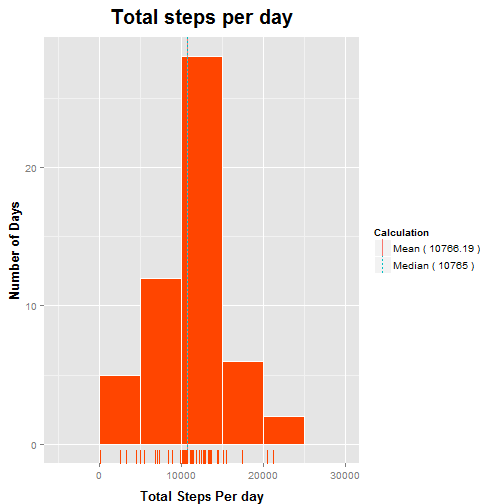
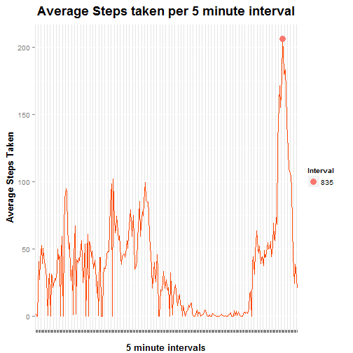
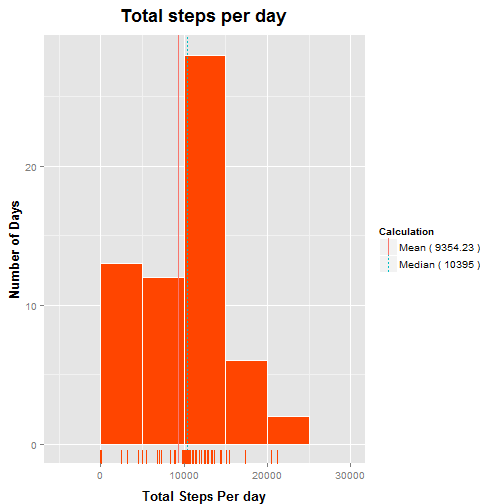
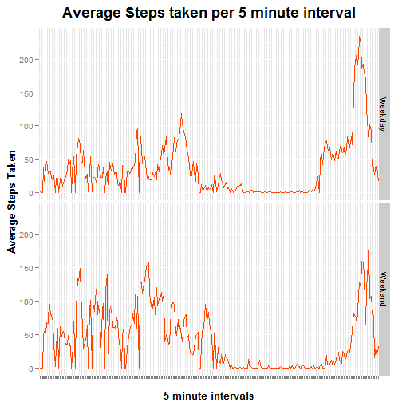

# Reproducible Research: Peer Assessment 1


## Loading and preprocessing the data


```r
### Clear the Workspace and load the libraries
rm(list = ls())
library(ggplot2)

### Load the data
activity.data <- read.csv("activity.csv")
```

## What is mean total number of steps taken per day?

```r
### Calculate the total steps taken per day
total.steps.per.day <- tapply(activity.data$steps , activity.data$date , sum )
total.steps.per.day <- as.data.frame (total.steps.per.day)
total.steps.per.day$date <- rownames(total.steps.per.day)

### Modify the row and column names appropriately
rownames(total.steps.per.day) <- seq( along = total.steps.per.day$date)
colnames(total.steps.per.day) <- c("steps" , "date")

### Calculate the mean and median and merge them
mean.steps <- data.frame ( Calculation = "Mean", value =  mean(total.steps.per.day$steps ,  na.rm=TRUE))
median.steps <- data.frame (Calculation = "Median" , value = median(total.steps.per.day$steps ,  na.rm=TRUE))

line_data <- rbind (mean.steps , median.steps)

### Print the mean and median data
mean.steps.string <- paste("Mean (", round(mean.steps$value, digits = 2), ")")
median.steps.string <- paste("Median (", round(median.steps$value, digits = 2), ")")

print(paste("The mean total steps taken per day is ", round(mean.steps$value, digits = 2)))
```

```
## [1] "The mean total steps taken per day is  10766.19"
```

```r
print(paste("The median total steps taken per day is ", round(median.steps$value, digits = 2)))
```

```
## [1] "The median total steps taken per day is  10765"
```

```r
### Plot the total steps per day with mean and median data
ggplot(data = total.steps.per.day, aes(x=steps )) + 
	geom_histogram(binwidth = 5000 , color = "white" , fill = "orangered") + 
	geom_vline( data = line_data , aes(xintercept = value  , linetype = Calculation,  color = Calculation) , show_guide = TRUE) +
	geom_rug(color = "orangered") +
	labs(x="Total Steps Per day") +
	labs(y="Number of Days") +
	labs(title="Total steps per day") +
	theme(axis.title.x = element_text( face = "bold" , size = "13" , vjust = -0.50)) +
	theme(axis.title.y = element_text( face = "bold" , size = "13" , vjust = 1)) +
	theme(plot.title = element_text( face = "bold", size = 20 , vjust = 2)) +
	scale_linetype_discrete(name  ="Calculation",
                           breaks=c("Mean", "Median"),
                           labels=c(mean.steps.string, median.steps.string)) +
	scale_colour_discrete(name  ="Calculation",
                            breaks=c("Mean", "Median"),
                            labels=c(mean.steps.string, median.steps.string))
```

 

## What is the average daily activity pattern?

```r
### Calculate the average number of steps per interval
average.steps.taken <- tapply(activity.data$steps , activity.data$interval, mean, na.rm=TRUE)

### Create a data frame and name the rows and columns appropriately
average.steps.taken <- as.data.frame(average.steps.taken)
average.steps.taken$interval <- rownames(average.steps.taken)

rownames(average.steps.taken) <- seq(along = average.steps.taken$interval)
colnames(average.steps.taken) <- c("Average","Interval")

### Find the interval with the maximum average number of steps and print the information
max.average.stepsValue = max(average.steps.taken$Average)
max.average.steps <- average.steps.taken[average.steps.taken$Average == max.average.stepsValue, ]

print(paste("The maximum average number of steps taken is ", round(max.average.steps$Average, digits = 2)))
```

```
## [1] "The maximum average number of steps taken is  206.17"
```

```r
print(paste("The interval id of the interval which contains this maximum average number of steps is ", max.average.steps$Interval))
```

```
## [1] "The interval id of the interval which contains this maximum average number of steps is  835"
```

```r
### Plot the average steps taken per 5 minute interval and indicate the highest value of the average steps taken
ggplot(data = average.steps.taken , aes(x = Interval , y = Average, group = 1)) +
	geom_line(color = "orangered" , width = 4) +
	theme(axis.text.x = element_blank()) +
	labs(x="5 minute intervals") +
	labs(y="Average Steps Taken") +
	labs(title="Average Steps taken per 5 minute interval") +
	theme(axis.title.x = element_text(face = "bold" , size = 13 , vjust = -0.50)) +
	theme(axis.title.y = element_text(face="bold", size =13, vjust = 1))+
	theme(plot.title = element_text(face="bold", size = 18, vjust = 2)) +
	geom_point(data=max.average.steps , aes(x= Interval, y= Average, color = Interval), size = 4, show_guide = TRUE)
```

 


## Imputing missing values

```r
### Omit the number of rows with NAs and find the difference
activity.data.clean <- na.omit(activity.data)
total.rows.with.nas <- nrow(activity.data) - nrow(activity.data.clean)

print(paste("The total number of rows with na's is ",total.rows.with.nas))
```

```
## [1] "The total number of rows with na's is  2304"
```

```r
### The only variable which has missing values 
### is the 'steps' variable.  

### STRATEGY FOR FILLING MISSING VALUES
### All the missing values will be set to ZERO

activity.data.filled <- read.csv("activity.csv")
activity.data.filled$steps[ is.na(activity.data.filled$steps) ] <- 0

### Code to calculate the total number of steps per day 
### and report the mean and median AFTER the missing values have been filled in

### SAME CODE AS QUESTION 1. ONLY THE DATA FRAME HAS BEEN CHANGED FROM 
### activity.data TO activity.data.filled

### Calculate the total steps taken
total.steps.per.day <- tapply(activity.data.filled$steps , activity.data$date , sum )
total.steps.per.day <- as.data.frame (total.steps.per.day)
total.steps.per.day$date <- rownames(total.steps.per.day)

rownames(total.steps.per.day) <- seq( along = total.steps.per.day$date)
colnames(total.steps.per.day) <- c("steps" , "date")

### Calculate the mean and median values and print them

mean.steps <- data.frame ( Calculation = "Mean", value =  mean(total.steps.per.day$steps ,  na.rm=TRUE))
median.steps <- data.frame (Calculation = "Median" , value = median(total.steps.per.day$steps ,  na.rm=TRUE))

line_data <- rbind (mean.steps , median.steps)
mean.steps.string <- paste("Mean (", round(mean.steps$value, digits = 2), ")")
median.steps.string <- paste("Median (", round(median.steps$value, digits = 2), ")")

print(paste("The mean total steps taken per day is ", round(mean.steps$value, digits = 2)))
```

```
## [1] "The mean total steps taken per day is  9354.23"
```

```r
print(paste("The median total steps taken per day is ", round(median.steps$value, digits = 2)))
```

```
## [1] "The median total steps taken per day is  10395"
```

```r
### Plot the total steps taken per day
ggplot(data = total.steps.per.day, aes(x=steps )) + 
	geom_histogram(binwidth = 5000 , color = "white" , fill = "orangered") + 
	geom_vline( data = line_data , aes(xintercept = value  , linetype = Calculation,  color = Calculation) , show_guide = TRUE) +
	geom_rug(color="orangered") +
	labs(x="Total Steps Per day") +
	labs(y="Number of Days") +
	labs(title="Total steps per day") +
	theme(axis.title.x = element_text( face = "bold" , size = "13" , vjust = -0.50)) +
	theme(axis.title.y = element_text( face = "bold" , size = "13" , vjust = 1)) +
	theme(plot.title = element_text( face = "bold", size = 18 , vjust = 2)) +
	scale_linetype_discrete(name  ="Calculation",
                           breaks=c("Mean", "Median"),
                           labels=c(mean.steps.string, median.steps.string)) +
	scale_colour_discrete(name  ="Calculation",
                            breaks=c("Mean", "Median"),
                            labels=c(mean.steps.string, median.steps.string))
```

 


## Are there differences in activity patterns between weekdays and weekends?

```r
### Code to insert factor variable - start
week.data <- weekdays ( as.Date(activity.data$date) ) 

isWeekDay <- sapply(week.data, function(x){ 
	if(x=="Sunday" || x=="Saturday")
		"N"
	else
		"Y"		
})

isWeekDay <- as.data.frame(isWeekDay)
colnames(isWeekDay) <- c("Weekday")

activity.data$isWeekday <- isWeekDay$Weekday
### Code to insert factor variable - end

### Weekday Average Calculation - start
activity.data.weekday <- activity.data[activity.data$isWeekday == "Y",]

average.steps.taken.weekday <- tapply(activity.data.weekday$steps , activity.data.weekday$interval, mean, na.rm=TRUE)

average.steps.taken.weekday <- as.data.frame(average.steps.taken.weekday)
average.steps.taken.weekday$interval <- rownames(average.steps.taken.weekday)

rownames(average.steps.taken.weekday) <- seq(along = average.steps.taken.weekday$interval)
colnames(average.steps.taken.weekday) <- c("Average","Interval")

average.steps.taken.weekday$Day_of_the_Week <- c("Weekday")

### Weekend Average Calculation - start

activity.data.weekend <- activity.data[activity.data$isWeekday == "N",]

average.steps.taken.weekend <- tapply(activity.data.weekend$steps , activity.data.weekend$interval, mean, na.rm=TRUE)

average.steps.taken.weekend <- as.data.frame(average.steps.taken.weekend)
average.steps.taken.weekend$interval <- rownames(average.steps.taken.weekend)

rownames(average.steps.taken.weekend) <- seq(along = average.steps.taken.weekend$interval)
colnames(average.steps.taken.weekend) <- c("Average","Interval")

average.steps.taken.weekend$Day_of_the_Week <- c("Weekend")

### Concatenate the data frames

average.steps.taken <- rbind(average.steps.taken.weekday, average.steps.taken.weekend)

### Plot the activity data
ggplot(data = average.steps.taken , aes(x = Interval , y = Average, group = 1)) +
	geom_line(color = "orangered" , width = 4) +
	facet_grid(Day_of_the_Week ~ .) +
	theme(axis.text.x = element_blank()) +
	labs(x="5 minute intervals") +
	labs(y="Average Steps Taken") +
	labs(title="Average Steps taken per 5 minute interval") +
	theme(axis.title.x = element_text(face = "bold" , size = 13 , vjust = -0.50)) +
	theme(axis.title.y = element_text(face="bold", size =13, vjust = 1))+
	theme(plot.title = element_text(face="bold", size = 18, vjust = 2))
```

 


